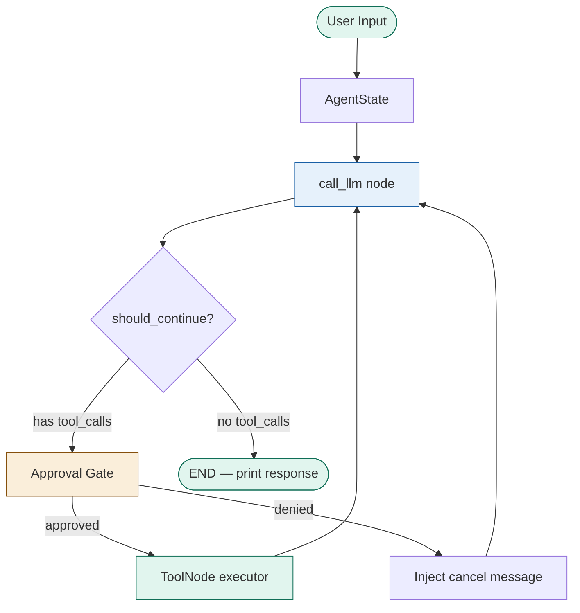

# ॐ
---

# AkX 0.0.0 — Custom CLI Agent 

A Codex-style CLI agent built with LangGraph, LangChain, and your own LLM. Supports local models via Ollama, remote APIs like Groq and OpenAI, and comes with a human approval gate, persistent memory, and built-in file + shell tools.

---

## Features

- LangGraph state machine with a clean agentic loop
- Human-in-the-loop approval gate before any tool runs
- Persistent memory across sessions via SQLite checkpointing
- Built-in tools: shell executor, file read/write, directory listing
- Swap any LLM — Ollama, Mistral, LLaMA, GPT-4o, Groq, and more
- Rich terminal UI with markdown rendering

---

## Project Structure

```
Akx/
├── main.py               # CLI entry point
├── config.py             # Model settings and system prompt
├── memory.py             # SQLite checkpointer
├── pyproject.toml
└── agent/
    ├── __init__.py
    ├── graph.py           # LangGraph state machine
    ├── nodes.py           # LLM node + routing logic
    ├── state.py           # AgentState definition
    └── tools/
        ├── __init__.py
        ├── registry.py    # Tool registry
        ├── shell.py       # Shell executor tool
        └── files.py       # File read/write tools
```

---

## Requirements

- Python >= 3.14
- [uv](https://github.com/astral-sh/uv) (recommended) or pip
- [Ollama](https://ollama.com) for local models

---

## Installation

```bash
# Clone the repo
git clone https://github.com/yourname/akx.git
cd akx

# Install dependencies
uv sync

# Or with pip
pip install langgraph langchain-openai langchain-core langgraph-checkpoint-sqlite rich typer
```

---

## Usage

### With Ollama (local)

```bash
# Pull a model first
ollama pull mistral

# Run the agent
export AGENT_BASE_URL=http://localhost:11434/v1
export AGENT_MODEL=mistral
python main.py
```

### With OpenAI

```bash
export OPENAI_API_KEY=sk-...
export AGENT_MODEL=gpt-4o
python main.py
```

### With Groq

```bash
export AGENT_BASE_URL=https://api.groq.com/openai/v1
export OPENAI_API_KEY=gsk_...
export AGENT_MODEL=llama3-8b-8192
python main.py
```

---

## Environment Variables

| Variable | Default | Description |
|---|---|---|
| `AGENT_MODEL` | `gpt-4o` | Model name to use |
| `AGENT_BASE_URL` | `None` | Custom API base URL (Ollama, vLLM, Groq) |
| `OPENAI_API_KEY` | `ollama` | API key |
| `AGENT_AUTO_APPROVE` | `false` | Skip tool approval prompts |
| `AGENT_MAX_TOKENS` | `4096` | Max tokens per response |

---

## Example Session

```
CLI Agent — type exit to quit

>>> list the files in the current directory

Tool: list_dir
{'path': '.'}
Run these tools? [Y/n]: y

main.py  config.py  memory.py  agent/  pyproject.toml

>>> create a hello.py with a hello world script

Tool: write_file
{'path': 'hello.py', 'content': 'print("Hello, world!")'}
Run these tools? [Y/n]: y

Done! hello.py has been created.

>>> run it

Tool: run_shell
{'command': 'python hello.py'}
Run these tools? [Y/n]: y

Hello, world!
```

---

## Built-in Tools

| Tool | Description |
|---|---|
| `run_shell` | Run any bash/shell command |
| `read_file` | Read a file's contents |
| `write_file` | Write or create a file |
| `list_dir` | List files in a directory |

---

## Adding New Tools

Create a new file in `agent/tools/`, define a function with the `@tool` decorator, then add it to `registry.py`:

```python
# agent/tools/my_tool.py
from langchain_core.tools import tool

@tool
def my_tool(input: str) -> str:
    """Description of what this tool does."""
    return "result"
```

```python
# agent/tools/registry.py
from .my_tool import my_tool

ALL_TOOLS = [run_shell, read_file, write_file, list_dir, my_tool]
```

---

## Roadmap

- [ ] Streaming token output
- [ ] Web search tool
- [ ] Diff preview before file writes
- [ ] `--resume` flag to continue previous sessions
- [ ] `--model` CLI flag to switch LLMs on the fly
- [ ] Token usage display

---

---
 
## Workflow
 

 
